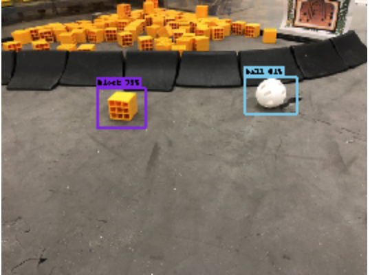

# Object detection

## Structure

-   `test.py` test the created model
-   `load_data.py` load the image data and annotations into an sframe
-   `train.py` create and train a model
-   `generator/` generated images annotations and test data
-   `App/` simple iOS app for real time evaluation of the model
-   `model/` location of mlmodel
-   `m.model` turicreate model (download [here](https://drive.google.com/file/d/175a3Nsz4WlwidJI_RDRQKWAJ7qGKxe1e/view?usp=sharing))

## How to run

1. clone this repo
2. install turicreate
3. run `test.py`

### Train model

run `train.py`

### generate sframe

run `load_data.py`

## Example output images

(notice how it only finds the blocks outside of the crater)

